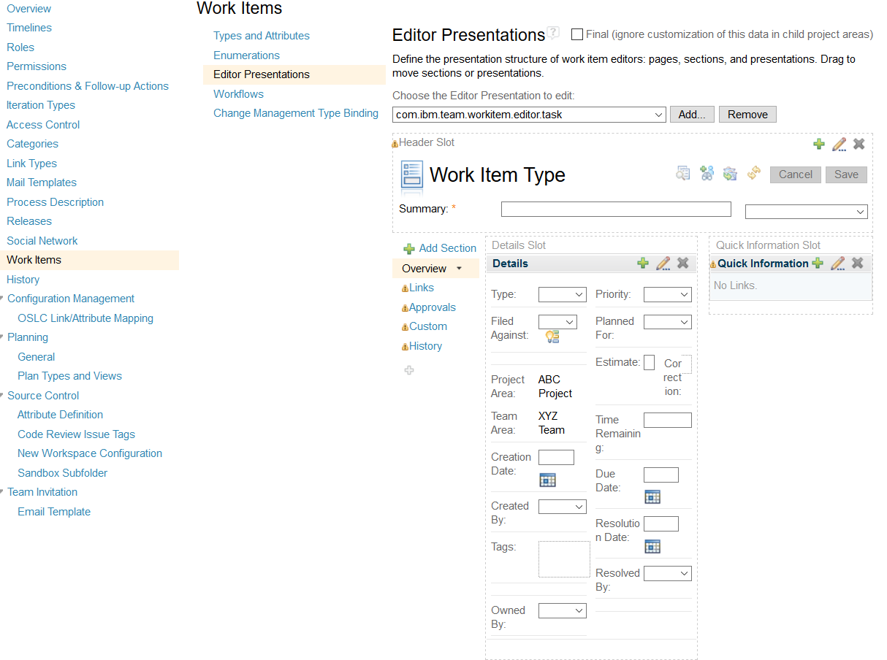

# Own Role Presentation for RTC

This Work Item editor presentation displays the authenticated users roles, depending on "Field against".
It is intended to help with missing permissions to save Work Item issues.


When the page loads and each time the "Filed Against" changes the roles the logged-in user has in the category associated team or project are displayed.
Whenever an attribute is changed it checks if user is allowed to modify that. Turns red if not and creates a tooltip/ popUp with more information. If 'Filed Against' is changed
it turns orange instead and text slightly changes to include modified attributes that need to be reset to default. This last feature only works if advanced configurations have been done.
Also updates the Team Area field.

## Setup

### Download

You can find the latest release on the [releases page of this repository](../../releases).

### Installation

Deploy just like any other update site:

1. Extract the `com.siemens.bt.jazz.viewlet.myteams.Team_updatesite.ini` **file** from the zip file to the `server/conf/ccm/provision_profiles` directory
2. Extract the `com.siemens.bt.jazz.viewlet.myteams.Team_updatesite` **folder** to the `server/conf/ccm/sites` directory
3. Restart the server

### Updating an existing installation

1. Request a server reset in **one** of the following ways:
   - If the server is currently running, call `https://server-address/ccm/admin/cmd/requestReset`
   - Navigate to `https://server-address/ccm/admin?internaltools=true` so you can see the internal tools (on the left in the side-pane).
     Click on `Server Reset` and press the `Request Server Reset` button
   - If your server is down, you can delete the ccm `built-on.txt` file.
     Liberty packed with 6.0.3 puts this file in a subfolder of `server/liberty/servers/clm/workarea/org.eclipse.osgi/**/ccm`. The easiest way to locate the file is by using your operating system's search capabilities.
2. Delete previously deployed updatesite folder
3. Follow the file extraction steps from the section above
4. Restart the server

### Configuration

Go to "manage (this) Project Area" -> Work Items -> Editor Presentation and choose the Editor Presentation you want to add it to.
In a section of your choosing click the green plus to add it.



In the popup choose "Non-Attribute-based Presentation", then "com.siemens.bt.jazz.rtc.workItemEditor.presentation.roles" as kind.
Give it a Label, Description and ID.


### Advanced Configuration (default values)

Open the eclipse client. Open the Project area or template you want to configure this for. Click process-configuration -> project-configuration -> configuration data
-> Work Items -> Editor Presentations. In case you haven't added the presentation yet do so now. Choose the presentation and click 'Edit ...'. Click the '+' to add
new properties. Use Attribute Id as key and the label of default value as value. For example internalPriority and low. Warning: A change in properties will overwrite
all from default, so use shared content and duplicate wisely and try to configure the defaults first before decoupling and going into specifics.

# Presentation Properties

You can use the Presentation Properties to configure the Presentation. The key of the properties are **case-sensitive**.

## External Link

If you want the presentation to show a link to another url (internal or external) in addition or exclusively instead of to the request request permission via E-Mail you should use this configuration.

The key is `externalLink` and the value is a JSON configuration

### Configuration

The configuration is a list of multiple sub-configurations. The `validProjectAreas` and `validTypes` will be checked to determine if the sub-configuration can be used.

| attribute         | value type | required | default           |
| ----------------- | ---------- | -------- | ----------------- |
| validProjectAreas | string[]   |          | `null`            |
| validTypes        | string[]   |          | `null`            |
| url               | string     | true     | -                 |
| icon              | string     |          | external-link.svg |
| description       | string     | true     | -                 |
| hideMailto        | boolean    |          | `false`           |

#### validProjectAreas

List with the names / labels of project areas which are allowed for this sub-config. If this attribute is not set or empty every project area will be marked as valid.

The name of the project area is case-insensitive.

You can use `*` at the beginning, the end or enclose a value with it to make a wildcard search. You can not use it between words.

##### example

`*Test Project Area*` would match `Test Project Area`, `My Test Project Area` and `My Test Project Area 2`

`Test Project Area*` would match `Test Project Area` and `Test Project Area 2` but not `My Test Project Area`

`*Test Project Area` would match `Test Project Area` and `My Test Project Area` but not `Test Project Area 2`

`Test Project Area` would match `Test Project Area` but not `My Test Project Area` or `Test Project Area 2`

`*Test*` would match `Test`, `Test Project Area`, `My Test Project Area` and `My Project Area 2 Test`

`test` would match `test`, `TEST`, `Test`, `tEsT`, `tESt` and so on.

#### validTypes

List of work item type ids which are allowed for this sub-config. If this attribute is not set or empty every work item type will be marked as valid.

#### url

The url which should be targeted once the external link was clicked

In order to add more information to the url, specific to the work item where the permission are missing you can use the following keys. In order to use a key in the url you need to use the following format: `{key}`

| key           | description                                              |
| ------------- | -------------------------------------------------------- |
| processAreaId | Id of the current processed area                         |
| workItemId    | Id of the current workitem                               |
| projectAreaId | Id of the project area belonging to the current workitem |
| teamAreaId    | Id of the team are belonging to the current workitem     |

##### example

`https://example.com/{projectAreaId}` would result in `https://example.com/_qdDeafdadfaafad`

`https://example.com/access?id={workItemId}` would result in `https://example.com/access?id=540`

`https://access.example.com/{projectAreaId}/{workItemId}` would result in `https://access.example.com/_qdDeafdadfaafad/540`

#### icon

The icon that should be displayed instead of the default one. Needs to be the full path to the image.


#### description

Text that will be displayed next to the icon that will be clickable

#### hideMailto

Should the Mail button be visible when an external link is being displayed

#### examples

Full match for project area and work item type. With custom icon:

```json
[
  {
    "validProjectAreas": ["Test Project Area"], // Only if the project are has this name
    "validTypes": ["com.ibm.team.workitem.workItemType.feature"], // Only if the workitem is of type feature
    "url": "https://permissions.example.com/{projectAreaId}/{teamAreaId}/{workItemId}",
    "description": "Request access over Permission-Tool",
    "icon": "https://cdn.example.com/icons/permissions.svg", // Use custom icon
    "hideMailto": true
  },
  {...}, // Another sub config
  {...}  // Another sub config
]
```

Project area needs to match a value from the list. Work item type can be any. With custom icon:

```json
[
  {
    "validProjectAreas": ["Test Project area", "Another Project area"], // Only if the project are has one of this names
    "validTypes": [], // Any workitem type
    "url": "https://permissions.example.com/{projectAreaId}/{teamAreaId}/{workItemId}",
    "description": "Request access over Permission-Tool",
    "icon": "https://cdn.example.com/icons/permissions.svg", // Use custom icon
    "hideMailto": true
  },
  {...}, // Another sub config
  {...}  // Another sub config
]
```

Project area needs to match wildcard. Work item type needs to be one from the list:

```json
[
  {
    "validProjectAreas": ["PCM*"], // Only if the project are starts with this value
    "validTypes": ["com.ibm.team.workitem.workItemType.feature", "com.ibm.team.workitem.workItemType.story"], // One of the workitem types
    "url": "https://permissions.example.com/{projectAreaId}/{teamAreaId}/{workItemId}",
    "description": "Request access over Permission-Tool",
    "hideMailto": true
  },
  {...}, // Another sub config
  {...}  // Another sub config
]
```

Project area and work item type can be any:

```json
[
  {
    "validProjectAreas": [], // Any project area
    "validTypes": [], // Any workitem type
    "url": "https://permissions.example.com/{projectAreaId}/{teamAreaId}/{workItemId}",
    "description": "Request access over Permission-Tool",
    "hideMailto": true
  },
  {...}, // Another sub config
  {...}  // Another sub config
]
```

# About this Plug-In

## Compatibility

This plug-in has been verified to work on RTC 6.0.3 and onward. According to our information, the mechanism for creating non-attribute-based presentations has not changed since one of the first releases of RTC, so we expect it to work with any version of RTC. If not, we would appreciate your feedback.

## Contributing

Please use the [Issue Tracker](../../issues) of this repository to report issues or suggest enhancements.

For general contribution guidelines, please refer to [CONTRIBUTING.md](https://github.com/jazz-community/welcome/blob/master/CONTRIBUTING.md)

## Licensing

Copyright (c) Siemens AG. All rights reserved.<br>
Licensed under the [MIT](./LICENSE) License.
