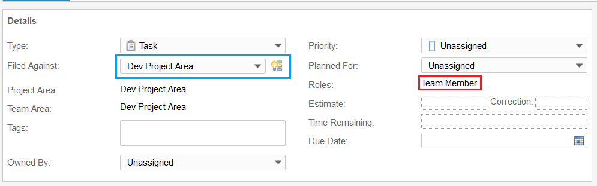
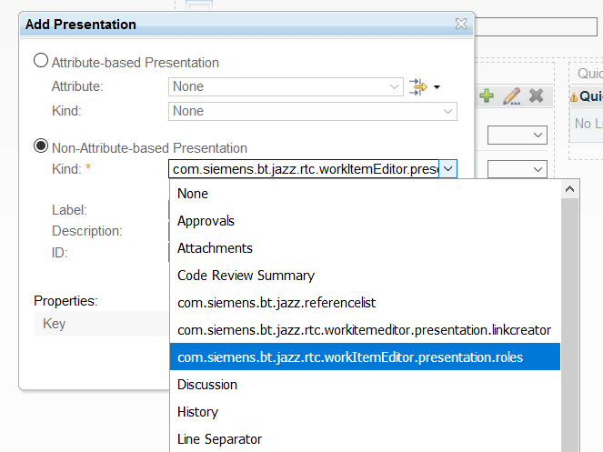

# Own Role Presentation for RTC

This Work Item editor presentation displays the authenticated users roles, depending on "Field against".
It is intended to help with missing permissions to save Work Item issues.

When the page loads and each time the "Filed Against" changes the roles the logged-in user has in the category associated team or project are displayed.
This includes inherited roles and essentially gives a clue if the user has necessary permissions to change the Workitem.

## Setup

### Download
You can find the latest release on the [releases page of this repository](../../releases).

### Installation
Deploy just like any other update site:

1. Extract the `com.siemens.bt.jazz.viewlet.myteams.Team_updatesite.ini` **file** from the zip file to the `server/conf/ccm/provision_profiles` directory
2. Extract the `com.siemens.bt.jazz.viewlet.myteams.Team_updatesite` **folder** to the `server/conf/ccm/sites` directory
3. Restart the server

### Updating an existing installation
1. Request a server reset in **one** of the following ways:
    * If the server is currently running, call `https://server-address/ccm/admin/cmd/requestReset`
    * Navigate to `https://server-address/ccm/admin?internaltools=true` so you can see the internal tools (on the left in the side-pane).
     Click on `Server Reset` and press the `Request Server Reset` button
    * If your server is down, you can delete the ccm `built-on.txt` file.
     Liberty packed with 6.0.3 puts this file in a subfolder of `server/liberty/servers/clm/workarea/org.eclipse.osgi/**/ccm`. The easiest way to locate the file is by using your operating system's search capabilities.
2. Delete previously deployed updatesite folder
3. Follow the file extraction steps from the section above
4. Restart the server

### Configuration
Go to "manage (this) Project Area" -> Work Items -> Editor Presentation and choose the Editor Presentation you want to add it to.
In  a section of your choosing click the green plus to add it.

In the popup choose "Non-Attribute-based Presentation", then "com.siemens.bt.jazz.rtc.workItemEditor.presentation.roles" as kind.
Give it a Label, Description and ID.

# About this Plug-In
## Compatibility
This plug-in has been verified to work on RTC 6.0.3 and onward. According to our information, the mechanism for creating non-attribute-based presentations has not changed since one of the first releases of RTC, so we expect it to work with any version of RTC. If not, we would appreciate your feedback.

## Contributing
Please use the [Issue Tracker](../../issues) of this repository to report issues or suggest enhancements.

For general contribution guidelines, please refer to [CONTRIBUTING.md](https://github.com/jazz-community/welcome/blob/master/CONTRIBUTING.md)

## Licensing
Copyright (c) Siemens AG. All rights reserved. 
Licensed under the [MIT](./LICENSE) License.
